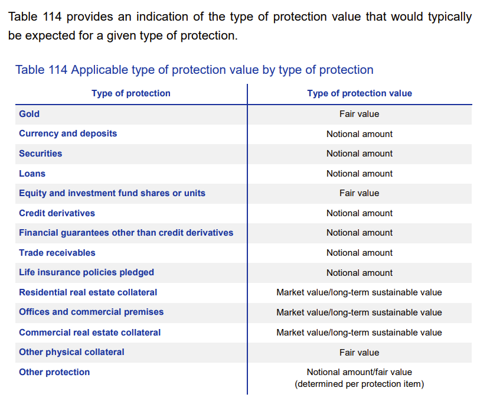

# value_type

---

**Type of protection value** 
This data attribute is used for identifying the type of the protection value that corresponds to the protection value as reported in the data attribute “protection value”.



Notional amount and fair value are reported using **notional_amount** and **mtm_dirty** respectively.
For real estate collateral, the value type is derived by combining **collateral.value** with **value_type** enums. 

```bash
├── long_term
└──  market
```

### long_term
**Long-term sustainable value**

If the appraisal aims to estimate the market value ignoring cyclical factors, then “long-term sustainable value” is reported.
Reference: The “mortgage lending value” of immovable property as defined in Article 4(1)(74) of Regulation (EU) No 575/2013. 

### market
**Market value**
The market value is a value type to be used only for real estate collateral.
The current “market value” of immovable property as defined in Article 4(1)(76) of Regulation (EU) No 575/2013.

> The market value means the estimated amount for which the property could be exchanged on the date of valuation between a willing buyer and a willing seller in an arm’s-length transaction after proper marketing wherein the parties had each acted knowledgeably, prudently and without compulsion.

---